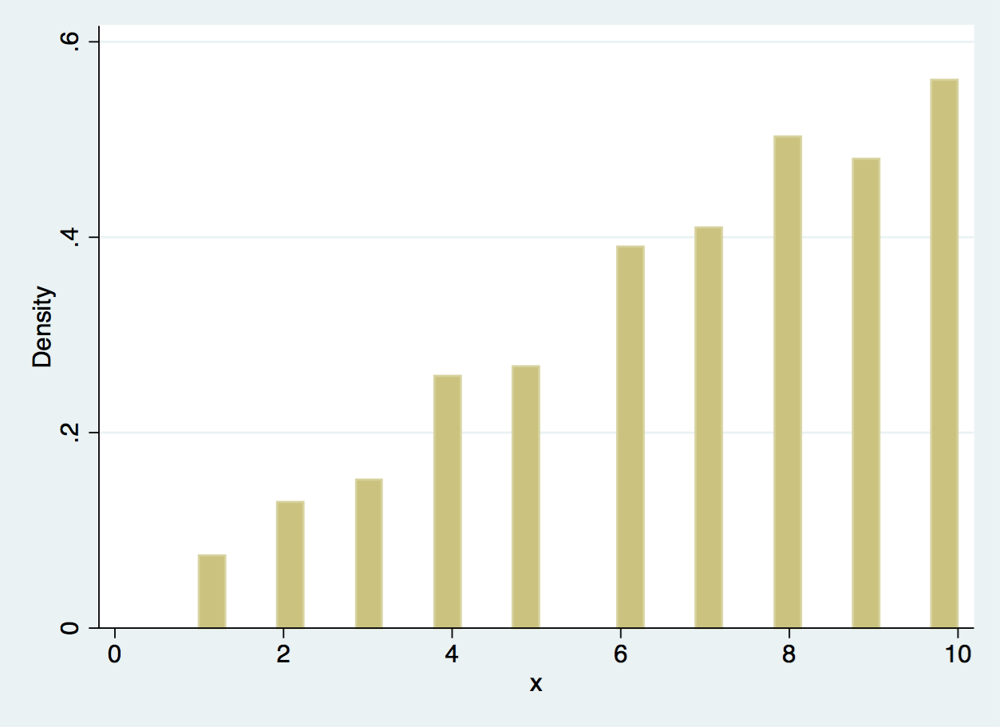

## 

```{r, echo = FALSE, results = 'hide'}
library('knitr')
library('rio')
```

```{r 'graphics', out.width = "700px", echo = FALSE}
include_graphics("free-vector-colorful-barcode-graphics-vector_001621_2131312.jpg")
```

[Source](http://4vector.com/free-vector/colorful-barcode-graphics-vector-1621)


##


```{r 'rgraphics', out.width = "700px", echo = FALSE}

```

[Source](http://nar.oxfordjournals.org/content/early/2016/09/29/nar.gkw852)


## Common plots

> * Histograms
> * Boxplots
> * Barplots
> * Scatterplots
> * ...


## How would you plot x? {.build}

```{r}
set.seed(20161108)
x <- sample(x = 1:10, size = 1000, replace = TRUE,
    prob = (1:10)/sum(1:10) )
head(x)
summary(x)
```


```{r, echo = FALSE}
export(data.frame(x = x), 'x.dta')
```

## {.build}

```{r}
plot(x)
```


## Boxplot? {.build}


```{r}
boxplot(x)
```


## Histogram? {.build}

```{r}
hist(x)
```

## {.build}

```{r}
set.seed(201611082)
plot(seq_len(length(x)), jitter(x, 0.5))
```


## Takeaways

> * It's good to explore your data in more than one plot.
> * We need something where we can easily change the type of plot.
> * Sometimes we need to go beyond and customize our plot a bit it's readability.

## What about Stata? {.build}

```
use "x.dta", clear
histogram x
```

```{r 'statax', out.width = "700px", echo = FALSE}

```

## {.build}

```
graph box x
```


```{r 'statax_box', out.width = "700px", echo = FALSE}

```

## Can we make it nicer? {.build}

```
graph box x, box(1, fcolor(dkorange)) ///
	ytitle(Our X variable) ///
	title(A nicer plot) subtitle(Made by Leonardo) ///
	caption(This plot is closer to being finished)
```

##

```{r 'statax_box_nice', out.width = "700px", echo = FALSE}

```


## At least three types of plots

> * Quick and dirty: for you or a meeting with close collaborators.
> * For a presentation: make sure people can read it!
> * For a journal


## Graphics in Stata

<div class="columns-2">
  

  - Stata 14.1 for Mac
</div>

## Graphics in R

> * Quick and dirty: either with R-base or ggplot2
> * For a presentation: similar, just a few more options
> * For a journal: any, but might need more details.
> * Other options: https://cran.r-project.org/view=Graphics


## Why ggplot2? {.smaller}

```{r}
library('ggplot2')

## Some example data
head(diamonds)
```

## Nicer defaults

```{r}
qplot(x = carat, y = price, data = diamonds)
```

## Can easily involve more than two variables

```{r}
qplot(x = carat, y = price, color = cut, data = diamonds)
```

## Set colors based on the third variable

```{r}
qplot(x = carat, y = price, color = cut, data = diamonds) +
    scale_color_brewer(palette = 'PuOr')
```


## Separate by a fourth one


```{r}
qplot(x = carat, y = price, color = cut, data = diamonds) +
    scale_color_brewer(palette = 'PuOr') +
    facet_grid(. ~ color, labeller = label_both)
```

## Change theme

```{r}
qplot(x = carat, y = price, color = cut, data = diamonds) +
    scale_color_brewer(palette = 'PuOr') +
    facet_grid(. ~ color) + theme_bw(base_size = 20)
```


## Treatment Episode Data {.build}

http://wwwdasis.samhsa.gov/dasis2/teds.htm

```{r}
load('teds2014.Rdata')
table(sapply(teds2014, class))
colnames(teds2014)[sapply(teds2014, is.numeric)]
```

##

```{r}
qplot(CASEID, DAYWAIT, data = teds2014)
```

##

```{r}
qplot(CASEID, DAYWAIT, color = GENDER, data = teds2014)
```

##

```{r}
qplot(CASEID, DAYWAIT, color = GENDER, data = teds2014) +
    facet_grid(. ~ GENDER)
```

##

```{r}
library('productplots')
prodplot(teds2014, ~ GENDER)
```

[Paper](http://ieeexplore.ieee.org/document/6064987/?arnumber=6064987&tag=1)

##

```{r}
prodplot(teds2014, ~ MARSTAT + GENDER)
```

##


```{r 'rgraphics2', out.width = "700px", echo = FALSE}

```

[Source](http://nar.oxfordjournals.org/content/early/2016/09/29/nar.gkw852)


## Actual code:

```{r 'derfinderCode', eval = FALSE}
g1 <- ggplot(data = subset(emp_exons_one_cuts,
        Aligner == 'HISAT'),
    aes(x = FDR, y = Power, shape = StatMethod,
        color = cluster)) +
    geom_point(size = 3) + geom_line() +
    ylab('Empirical power') +
    xlab('Observed FDR (in percent)') +
    theme_linedraw(base_size = 16) +
    scale_color_brewer(palette = 'Set1', name = 'Group') +
    scale_shape_discrete(name = 'Statistical\nmethod')
g1
```

[Source](http://leekgroup.github.io/derSupplement/simulation/evaluate/evaluate.html)

## ggplot2 takeaways

> * Good defaults for quick and dirty
> * Easy to quickly change code and visualize other variables
> * Has an ecosystem that allows making more plots and facilitates changing things (colors, themes, etc)
> * Can be used for all types of plots: quick, presentation, journal-quality


## Interactive plots

> * Sometimes we want to play around with our data more
> * Interactive plots go from very simple to super specific
> * How can I visualize my data?
> * [shinycsv](https://jhubiostatistics.shinyapps.io/shinycsv/)

## Demo time

* https://jhubiostatistics.shinyapps.io/shinycsv/
* Data at https://github.com/lcolladotor/graphics_2016_11_09

## Case id vs numsubs {.build}

```
graph twoway scatter CASEID NUMSUBS
```

```{r, out.width = "600px", echo = FALSE}

```

## {.build}

```
graph box CASEID, by(NUMSUBS)
```


```{r, out.width = "700px", echo = FALSE}

```

##

```{r, out.width = "800px", echo = FALSE}

```

##

```{r, out.width = "800px", echo = FALSE}

```

## Exercise

* Use the prepared teds2014 subset data: R, Stata, [shinycsv](https://jhubiostatistics.shinyapps.io/shinycsv/), ...
* Does the relationship between education level and gender change by race?


## Solution

```{r}
suppressMessages( library('shinycsv') )
plot_twoway(teds2014$EDUC, teds2014$GENDER, 'educ', 'gender')
```

##


```{r}
df <- subset(teds2014, RACE == 'WHITE')
plot_twoway(df$EDUC, df$GENDER, 'educ', 'gender')
```

##

```{r}
df2 <- subset(teds2014, RACE == 'ASIAN')
plot_twoway(df2$EDUC, df2$GENDER, 'educ', 'gender')
```


## How I made the example data {.smaller}

```{r 'exampleData', eval = FALSE}
## Download http://wwwdasis.samhsa.gov/dasis2/teds_pubs/2014/Admissions/teds_a_2014_r.zip
load('teds_a_2014.rda')
set.seed(20161109)
teds2014 <- teds_a_2014[sample(seq_len(nrow(teds_a_2014)), 1e4), ]
save(teds2014, file = 'teds2014.Rdata')
rio::export(teds2014, file = 'teds2014.dta')
```


## More information

* https://mandymejia.wordpress.com/2013/11/13/10-reasons-to-switch-to-ggplot-7/
* http://www.cookbook-r.com/Graphs/
* Everything from today: http://lcolladotor.github.io/graphics_2016_11_09/

> * Thank you!


## Reproducibility info

```{r}
R.version.string
packageVersion('ggplot2')
packageVersion('productplots')
packageVersion('shinycsv')
```


